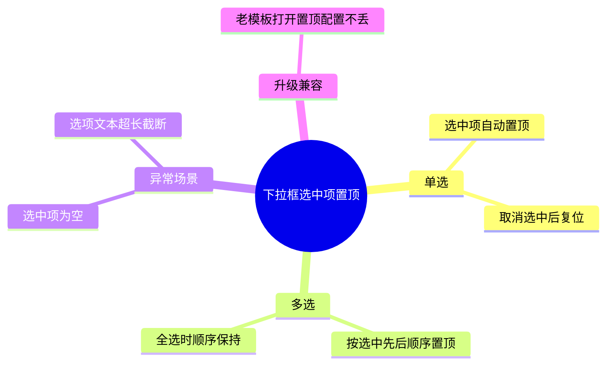

# 产物模板 · mermaid 规则 · 飞书回填

写第 4 步(生成草稿)和第 6 步(回填)前读这份。

## 一、完整文档模板

文档标题通过 create-doc 的 `title` 参数设置(默认 `<功能名>测试计划`),所以**正文不要再写与标题相同的一级标题**,直接从 `## 1.` 开始。

```markdown
## 1. 功能概要

<2~4 句:这是个什么功能、解决什么问题、归属哪个模块/场景>

## 2. 任务链接

<飞书任务链接;没有就写「待补充」>

## 3. 参考资料

- 功能文档:<链接或来源;无则「无」>
- 交互文档:<链接或来源;无则「无」>
- 开发文档:<链接或来源;无则「无」>
- 视觉文档:<链接或来源;无则「无」>

## 4. 计划概览

​`mermaid
mindmap
  root((功能名))
    一级场景A
      二级场景
        具体可验证的叶子点
    一级场景B
      ...
    异常场景
      空值 / 超长 / 非法输入
​`

## 5. 场景完善性自检

- [x] 功能文档、交互文档中的内容是否都有覆盖
- [x] 团队评审时提出的问题、场景是否有覆盖(包括后期群里讨论的场景)
- [x] 是否考虑了交叉场景(对相关功能场景的影响) —— <一句话:覆盖了哪些交叉点>
- [x] 是否考虑异常场景 —— <一句话>
- [ ] 是否考虑了国际化 —— <不涉及文案>
- [ ] 是否考虑升级兼容 —— <按需:结合功能文档(是否改动结构/默认值/数据格式)与项目现状(有无受影响老模板)判断;此处写判断结论及依据>
  - [ ] 兼容风险是否已提设计确认-设计风险
- [ ] 是否考虑了移动端 —— <按需:结合功能文档与项目现状(该组件在本项目有无移动端实现)判断;此处写判断结论及依据>

## 6. 审核/评审人员

- [ ] 测试计划审核 <mention-user id="<当前登录用户 open_id>"/> <reminder date="<回填当天+2天>T18:00+08:00" notify="true" user-id="<当前登录用户 open_id>"/>
```

> 上面 mermaid 块开头的 `​` 是为了在本说明里展示,真正写文档时用标准三反引号围栏。

### 第 5 节勾选语义

- `[x]` = **该维度已在第 4 节脑图里有对应场景覆盖**,后面用一句话说明覆盖在哪个分支。
- `[ ]` = **本需求不涉及该维度**(必须紧跟 `—— 原因`),或需人工补充确认。

这样评审人扫一眼未勾项的原因就能判断你是"漏想了"还是"确实不涉及"。别无脑全勾,也别全留空——勾选要和脑图分支对得上。

**升级兼容、移动端是「按需」维度**:不是每个需求都涉及。先按第 3 步的方法(结合功能文档 + 项目现状,必要时查代码)判断,涉及就 `[x]` 且脑图里有分支,不涉及就 `[ ]` 并写明判断依据(如"该筛选器无移动端实现")。别反射式地默认它们一定相关。

### 第 6 节:审核/评审人员

固定一条审核待办,带一个到点提醒:

`- [ ] 测试计划审核 <mention-user id="<当前登录用户 open_id>"/> <reminder date="YYYY-MM-DDT18:00+08:00" notify="true" user-id="<当前登录用户 open_id>"/>`

- **@当前登录用户 + 提醒接收人,都用当前登录用户**:回填前调用一次 `mcp__feishu-doc__get-user`(不传参 → 返回当前登录用户),拿到其 `open_id`,**同时**填进 `<mention-user id>` 和 `<reminder user-id>`(两处同一个 id)。
- **提醒时间**:取**回填当天**日期 **+2 天**,时间固定 **18:00**,时区 **+08:00**。用回填时的当前实际日期算,别写死示例日期。例:2026-06-22 回填 → `date="2026-06-24T18:00+08:00"`。
- **坑(必看)**:`<reminder>` **必须带 `user-id`**,否则写入被静默跳过(返回 `REMINDER_MISSING_USER_ID` 警告,日期就没了);`<task>` 待办则更写不进去(捏造 task-id 会被静默拍平成纯文本)。`<mention-user>` 和 reminder 可与待办文字写在同一行。读回文档时 `user-id` 会被隐去属于正常,提醒仍在。

## 二、mermaid mindmap 书写规则(写错飞书渲染会失败)

飞书把 `mermaid` 代码块转成原生可缩放脑图画板。`mindmap` 语法对格式敏感,照下面来:

1. **围栏 + 类型**:第一行 ` ```mermaid `,第二行单独一行 `mindmap`。
2. **单一根节点**:整张图只能有一个根。根用 `root((根文本))`,双层圆括号是根的固定写法。
3. **缩进定层级**:每深一层缩进 **2 个空格**,层级靠缩进而非符号。用空格,不要用 Tab。
4. **节点文本避开 ASCII 括号和方括号**:mermaid 把 `(` `)` `[` `]` `{` `}` 当形状语法,节点文本里出现会解析失败。
   - 要表达括号语义,用中文全角「」()或破折号改写。例:把 `选中项(单选)` 写成 `单选-选中项` 或 `选中项 单选`。
   - 根节点 `root((文本))` 里的"文本"同样别再带括号。
5. **一个节点一行**,文本尽量短(脑图节点过长会很难看);需要展开的细节往下再加一层子节点。
6. **不要**在 mindmap 里塞 markdown(`- [ ]`、`**加粗**、链接)——那是给第 5 节用的,不是脑图节点。
7. 节点文本里别用裸 `:` 开头或纯数字编号开头,容易被误解析;要编号就写「场景一 xxx」。

### 正确示例



### 渲染自检

回填后 create-doc / update-doc 会返回 `board_tokens`。**有 `board_tokens` 说明脑图成功渲染成画板**;若返回 warning 提示画板写入失败,多半是踩了上面第 4 条(括号)或第 3 条(缩进),改文本后重试。可选:用 `mcp__feishu-doc__fetch-file`(type=whiteboard)取 board 图给用户看一眼效果。

## 三、回填飞书(第 6 步)

确认后,**新建**一篇子文档挂到待审目录:

```
工具: mcp__feishu-doc__create-doc
参数:
  title:    "<功能名>测试计划"
  wiki_node: "MeOrwPsH7iIaFEklRrscs6bNnnc"   # 「AI生成待审核」目录节点
  markdown: <完整文档,真实换行>
```

目标目录 URL(等价):`https://fanruan-x.feishu.cn/wiki/MeOrwPsH7iIaFEklRrscs6bNnnc`

### 致命坑:必须传真实换行

调 create-doc / update-doc 的 `markdown` 参数时,**用真实换行符,绝不能用字面量 `\n`**。一旦把 `\n` 当文本传进去,整篇会被压成一行、mermaid 不渲染、标题全废。组织 markdown 字符串时确保每个换行是真换行。

### 其它

- 一次需求 = 一篇文档,挂进目录待人工评审,**不要覆盖/改动已有文档**。
- 创建成功后,把返回的 `doc_url` 给用户。
- 若 `wiki_node` 传 token 报错,改传完整 wiki URL 重试。
- 媒体只支持 url 不支持 token;本模板不需要插图片。
